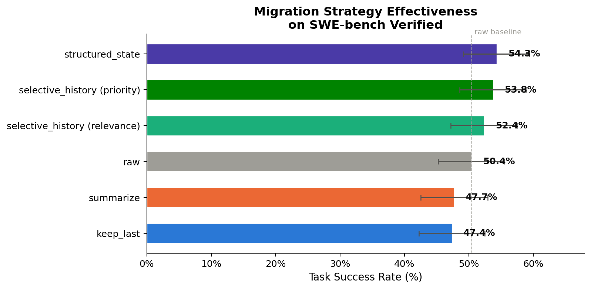
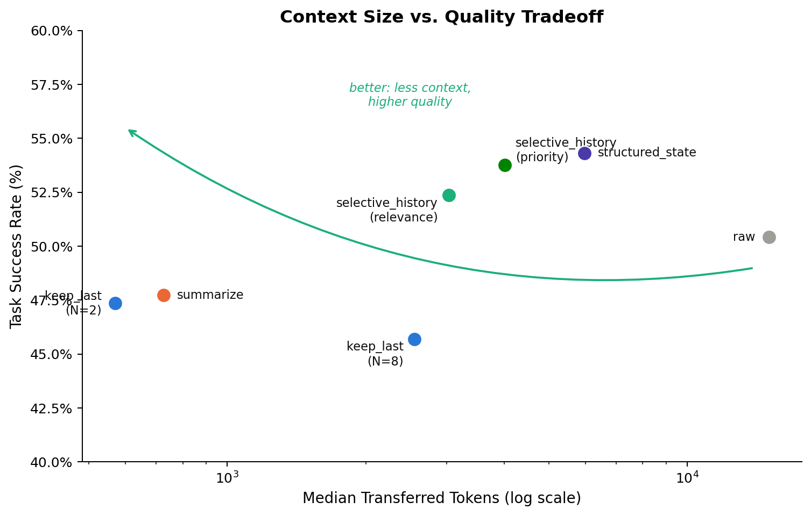
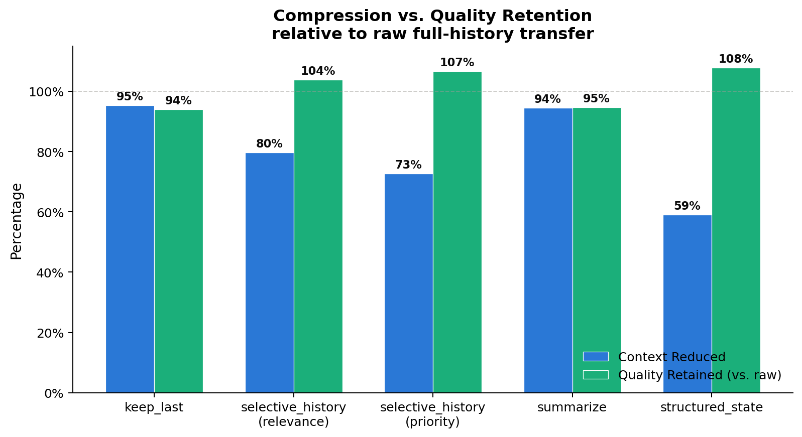
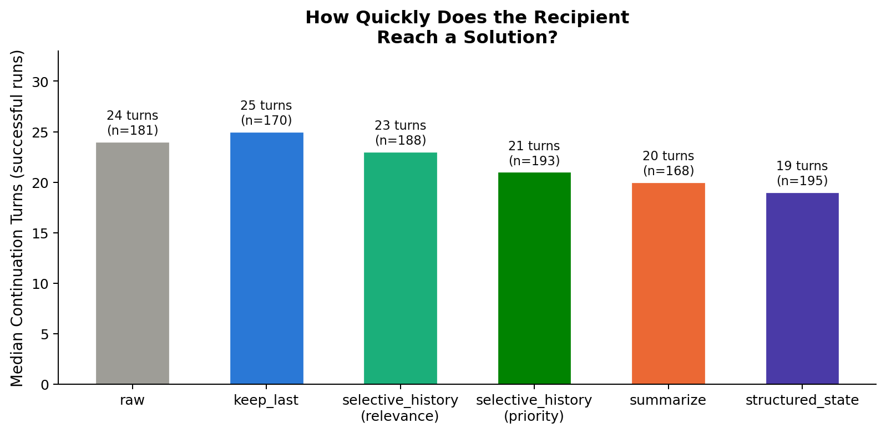
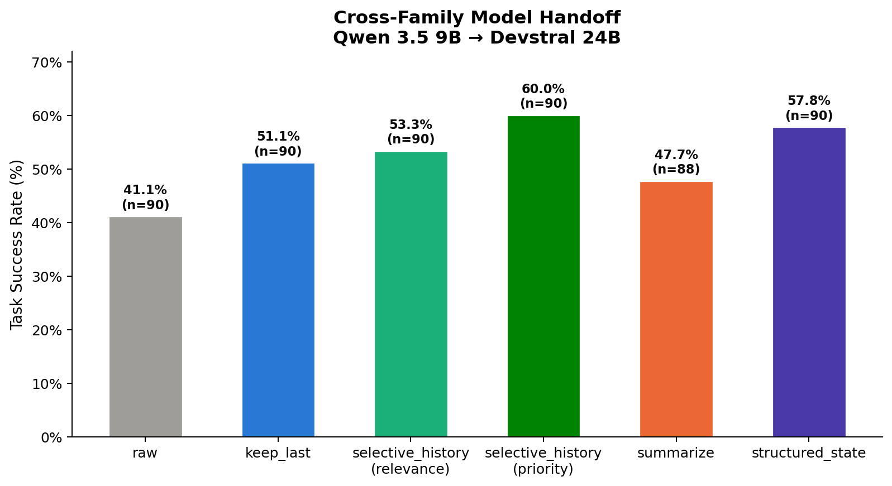
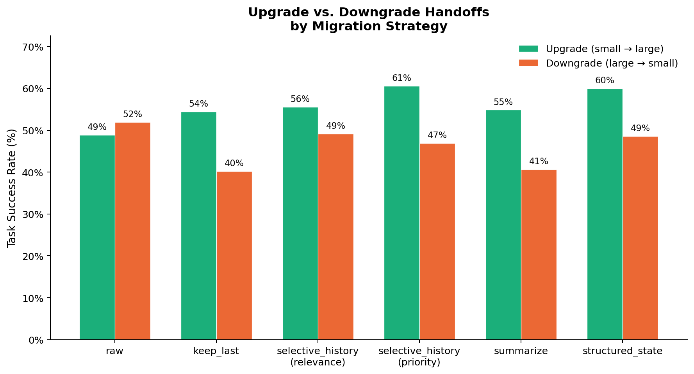
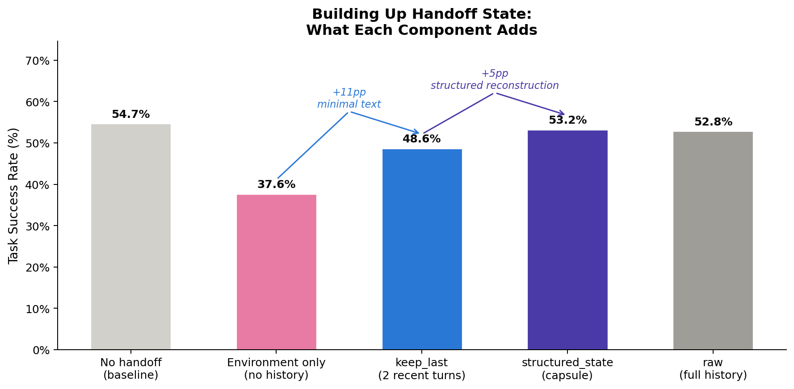

# Benchmark Results

These figures show how different migration strategies affect task success when switching models mid-conversation on [SWE-bench Verified](https://www.swebench.com), a benchmark of real-world GitHub issues resolved by applying code patches. For the headline findings, see the [benchmark section in the README](../README.md#does-migration-strategy-matter).

**At a glance:** 5,758 handoff runs across three open-weight models, evaluated with SWE-bench's official test harness. Structured and selective strategies matched or exceeded raw full-history transfer while using 60–80% less context — and on cross-family handoffs, raw transfer was the worst-performing strategy by a wide margin.

## Experimental Setup

| Parameter | Value |
|---|---|
| **Benchmark** | SWE-bench Verified (90 tasks, repository-stratified) |
| **Total runs** | 5,758 (5,015 handoff branches + 743 baselines) |
| **Models** | Qwen 3.5 9B, Qwen 3.6 27B, Devstral Small 2 24B |
| **Directed transitions** | 9B → 27B, 9B → Devstral, 27B → 9B, Devstral → 9B |
| **Handoff point** | 50% of source trajectory |
| **Execution** | Each model runs as an autonomous coding agent inside a Docker container. At the handoff point, the container filesystem is snapshotted and the recipient model resumes from the snapshot. |
| **Max turns per episode** | 150 |
| **Evaluation** | Official SWE-bench grading (FAIL_TO_PASS / PASS_TO_PASS test harness) |

All models were served via vLLM on OpenShift with thinking/reasoning mode disabled. GPU costs ranged from $1.86/hr (9B) to $5.25/hr (Devstral 24B). Total compute cost across all experiments: ~$3,000.

## Figures

### Strategy comparison

`structured_state`, `selective_history (priority)`, and `selective_history (relevance)` match or exceed full raw history transfer while using 60–80% less context.

### Context size vs. quality

The Pareto frontier runs through `selective_history` and `structured_state` — they sit in the upper-left (less context, higher quality). `raw` sits in the lower-right (maximum context, no quality gain). More tokens does not mean better outcomes.

### Compression efficiency

`structured_state` reduces context by 59% while retaining 108% of raw's quality (it slightly outperforms raw). `selective_history (priority)` reduces by 73% and retains 107%. The dashed line at 100% marks raw's quality level.

### Recipient orientation speed

Among successful runs, `structured_state` recipients solve the task in a median of 19 continuation turns vs. 24 for `raw`. Better-structured context helps the receiving model orient faster.

### Cross-family model handoff

When handing off between model families (Qwen → Devstral), full raw history is the worst strategy (41.1%). The source model's family-specific reasoning patterns appear to confuse the cross-family recipient. `selective_history (priority)` (60.0%) and `structured_state` (57.8%) abstract away these artifacts.

### Direction sensitivity

Upgrading to a larger model (green) consistently outperforms downgrading (orange). Better migration strategies reduce the gap — `selective_history (relevance)` has the smallest upgrade/downgrade spread (7pp) while `keep_last` has the largest (14pp). `raw` shows an unusual pattern: near-equal rates in both directions, suggesting full history compensates for weaker recipients.

### Building up handoff state

From E1 (30 tasks). Giving the recipient only the environment with zero text history performs worst (37.6%). Adding just 2 recent turns gains +11pp. Structured reconstruction adds another +5pp, nearly matching raw. Each state component contributes measurable value.
